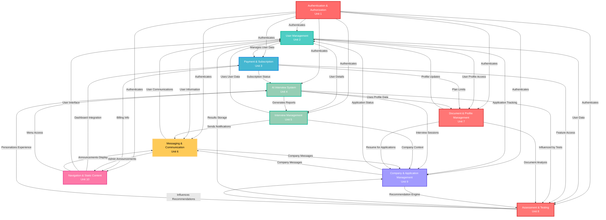

# Context Map - AI Interview Platform

## Overview

This context map illustrates the relationships between the 10 Units of Work (bounded contexts) in the AI Interview Platform, showing how they interact and depend on each other.

## Context Map Diagram

## Relationship Types and Patterns

### 1. **Upstream/Downstream Relationships**

#### Authentication as Core Upstream

- **Authentication & Authorization** serves as the foundational upstream context
- All other contexts depend on it for user identity and access control
- Provides: User sessions, role-based permissions, security tokens

#### User Management as Central Hub

- **User Management** acts as a central data provider
- Downstream contexts: Payment, Document Management, Interview Management, Messaging
- Provides: User profiles, account status, demographic data

### 2. **Customer/Supplier Relationships**

#### AI Interview System ← Interview Management

- AI Interview System (Customer) receives generated reports from Interview Management (Supplier)
- Interview Management processes interview data and creates structured reports

#### Payment ← User Management

- Payment system (Customer) receives user data from User Management (Supplier)
- User Management provides account details needed for billing

### 3. **Partnership Relationships**

#### Assessment ↔ AI Interview System

- Bidirectional partnership for personalized interview experiences
- Assessment results influence AI interview behavior
- Interview performance feeds back into assessment refinement

#### Company Management ↔ Messaging

- Partnership for application and communication workflows
- Company messages integrate with application tracking
- Status updates flow between both contexts

### 4. **Shared Kernel Relationships**

#### Document & Profile Management ↔ User Management

- Shared user profile data model
- Both contexts need to maintain consistency in user information
- Profile updates must be synchronized across both contexts

### 5. **Conformist Relationships**

#### Navigation → Multiple Contexts

- Navigation conforms to data models from various contexts
- Displays information from Payment, Messaging, User Management
- Acts as a presentation layer without influencing upstream logic

## Context Boundaries and Integration Points

### **Core Business Contexts**

- **AI Interview System** (Unit 4) - Core product functionality
- **Interview Management** (Unit 5) - Content and report management
- **Assessment & Testing** (Unit 8) - User evaluation and insights

### **Supporting Contexts**

- **Authentication & Authorization** (Unit 1) - Security foundation
- **User Management** (Unit 2) - User lifecycle management
- **Payment & Subscription** (Unit 3) - Business model support

### **User Experience Contexts**

- **Document & Profile Management** (Unit 7) - User data management
- **Messaging & Communication** (Unit 6) - User engagement
- **Navigation & Static Content** (Unit 10) - User interface

### **Business Integration Context**

- **Company & Application Management** (Unit 9) - External business integration

## Anti-Corruption Layers (ACL)

### External System Integration

- **Payment System**: ACL between internal subscription model and Stripe API
- **Company Data**: ACL between internal company model and Circus platform data
- **AI Services**: ACL between interview system and external AI/ML APIs

### Data Consistency Boundaries

- User profile synchronization between User Management and Document Management
- Interview data flow between AI Interview System and Interview Management
- Application status consistency between Company Management and User Management

## Shared Language and Ubiquitous Language

### Cross-Context Terms

- **User**: Consistent identity across all contexts
- **Interview**: Core concept spanning AI Interview, Interview Management, and Company contexts
- **Subscription**: Shared between Payment and User Management contexts
- **Application**: Common term in Company Management and User Management

This context map provides a clear view of how the bounded contexts interact, their dependencies, and the patterns of communication between them, enabling effective parallel development while maintaining system coherence.
